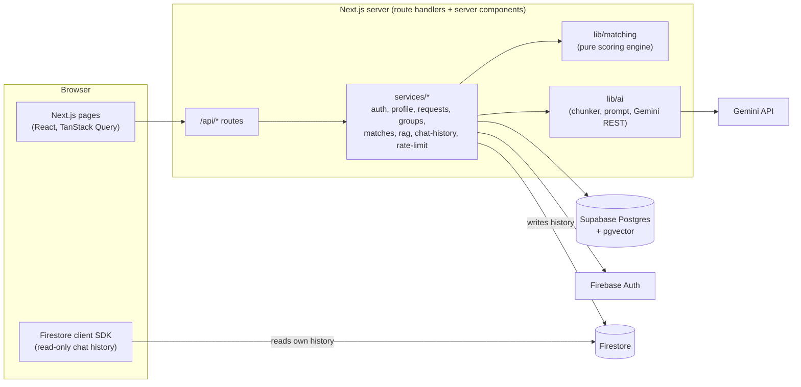
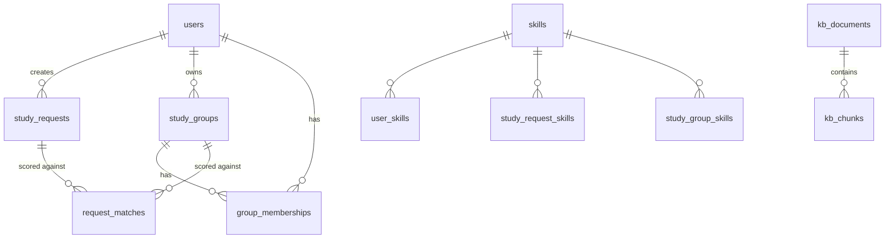

# SG Match

A study-group matching app. Students describe what they want to study, get a ranked list of study groups with a transparent, explainable score, create and join groups, and ask a study guide chatbot (RAG) that answers only from a small knowledge base, with citations.

- **Live app:** _TODO: add URL_
- **Reviewer access:** see [Test account / reviewer access](#test-account--reviewer-access)

---

## Contents

1. [Setup](#setup)
2. [Architecture overview](#architecture-overview)
3. [Deployed stack and services](#deployed-stack-and-services)
4. [Data model](#data-model)
5. [Matching algorithm](#matching-algorithm)
6. [RAG chatbot: ingestion and retrieval](#rag-chatbot-ingestion-and-retrieval)
7. [Test account / reviewer access](#test-account--reviewer-access)
8. [Environment variables](#environment-variables)
9. [Known limitations and next steps](#known-limitations-and-next-steps)

---

## Setup

**Prerequisites:** [Bun](https://bun.sh) 1.3+, a PostgreSQL database with the `pgvector` extension (we use Supabase), a Firebase project (Authentication with Email/Password enabled, plus Firestore), and a Gemini API key.

```bash
bun install
cp .env.example .env       # fill in the values (see Environment variables)
bun run ai:check           # optional: verifies the Gemini key, models and embedding size (3 small API calls)
bun run db:migrate         # creates all tables, enables pgvector and row level security
bun run db:seed all        # 37 skills, 12 sample users, 28 sample groups, 12 sample requests
bun run db:seed kb         # chunks and embeds the study guide knowledge base
bun run dev                # http://localhost:3000
```

Publish the Firestore rules once: paste `firestore.rules` into the Firebase console (Firestore → Rules → Publish), or use the Firebase CLI after `firebase init firestore`.

**Supabase tip:** use the **Session pooler** connection string (port 5432) from *Connect* in the dashboard. The direct `db.<ref>.supabase.co` host is IPv6-only and fails on many networks.

| Command | What it does |
|---|---|
| `bun run dev` / `bun run build` / `bun run start` | Develop / production build / serve the build |
| `bun run lint` | ESLint |
| `bun run test` | Unit tests (`bun test`) |
| `bun run db:generate` | Create a migration from schema changes |
| `bun run db:migrate` | Apply migrations |
| `bun run db:seed <name>` | `skills`, `users`, `groups`, `requests`, `all`, `kb`, or `unseed` (removes the sample data) |
| `bun run ai:check` | Check the Gemini configuration |
| `bun run ai:eval` | Retrieval evaluation for the chatbot (see below) |

---

## Architecture overview



- **One Next.js app** (App Router). Pages under `src/app/(protected)/` require a session; `src/app/api/` holds the route handlers. Route handlers stay thin and call **services** (`src/services/*.service.ts`), which hold the business rules and all database and external API access.
- **Pure logic is framework-free:** the matching engine (`src/lib/matching/`) and the RAG helpers (`src/lib/ai/`) have no database or Next.js imports, so they're easy to test and reason about.
- **Auth is server-side.** The browser never talks to Firebase Auth directly: it posts email and password to `/api/auth/*`, the server signs in through the Firebase Identity Toolkit REST API and sets an httpOnly session cookie (Firebase Admin). A SQL `users` row is created on first sign-in.
- **The browser only calls our own API.** The one exception is reading chat history: the server issues a Firebase custom token so the browser can read *its own* history live from Firestore, enforced by `firestore.rules` (read own, never write).
- **AI is used only in the study guide.** Matching is a deterministic calculation; it never calls an LLM or embeddings.

Main pages: `/` dashboard, `/matches` (requests and ranked groups), `/groups` and `/groups/[id]`, `/guide` (chatbot), `/profile`, `/onboarding`, `/auth`.

---

## Deployed stack and services

| Layer | Technology | Notes |
|---|---|---|
| App | Next.js 16 (App Router), React 19, TypeScript (strict) | |
| UI | Tailwind CSS v4, shadcn/ui (Radix), lucide icons, Sonner toasts | |
| Client data | TanStack Query, Axios, React Hook Form + Zod | Zod schemas are shared by forms and route handlers |
| Database | PostgreSQL + pgvector on **Supabase** (region: Mumbai, `ap-south-1`) | Drizzle ORM (`postgres-js` driver), drizzle-kit migrations |
| Auth | **Firebase Authentication** (email/password) | Server-side session cookies via `firebase-admin` |
| Chat history | **Cloud Firestore** | Written by the server (Admin SDK), read by the browser under `firestore.rules` |
| LLM + embeddings | **Google Gemini API** | Chat `gemini-3.1-flash-lite`, embeddings `gemini-embedding-001` (768 dimensions); model ids are configurable |
| Hosting | _TODO: add hosting platform and region_ | Host the app in the same region as the database for best latency |
| Tooling | Bun (package manager, scripts, test runner), ESLint | |

---

## Data model

All IDs are text of the form `<prefix>_<uuid>` (for example `usr_…`, `grp_…`). Every table has `created_at` / `updated_at`. Row level security is enabled on every table with no policies, so Supabase's public REST API can't read anything; the app connects as the database owner.



| Table | Purpose |
|---|---|
| `users` | One row per Firebase account (`firebase_uid` and `email` unique). Role `student` or `admin`. Study profile from onboarding: university, bio, experience level, study mode, location, `availability[]` (time slots), `interests[]` (topics). `onboarded_at` is null until onboarding is finished. |
| `skills` | Catalog of 37 skills (unique name, optional category). |
| `user_skills`, `study_request_skills`, `study_group_skills` | Join tables linking skills to users, requests and groups. |
| `study_requests` | "What I want a group for right now": title, subject, level, mode, location, availability, topics, skills. Up to 10 per user. |
| `study_groups` | A group with owner, description, level, mode, location, availability, topics, skills and `max_members` (2-20, default 6). Up to 5 owned per user. |
| `group_memberships` | A user's relationship with a group: `status` pending / accepted / rejected / withdrawn, `role` owner / member. Unique per (user, group). |
| `request_matches` | Stored score of each request against each group: score, confidence, reasons, caveats, per-signal breakdown (jsonb), `computed_at`. |
| `kb_documents`, `kb_chunks` | Study guide knowledge base: one document per markdown file; chunks hold heading, content, content hash, embedding model and a `vector(768)` embedding with an HNSW cosine index. |
| `ai_query_cache` | Embeddings of questions already asked, so repeats cost no embedding call. |
| `ai_usage` | Per-minute rate-limit counters (per user and global). |

Enums: `experience_level` (beginner, intermediate, advanced), `study_mode` (online, in person, hybrid), `membership_status`, `user_role`, `group_role`.

**Firestore** (chat history only): `users/{firebaseUid}/chatSessions/{sessionId}` (`title`, `createdAt`, `updatedAt`, `messageCount`) and `.../messages/{messageId}` (`role`, `text`, `citations`, `grounded`, `error`, `at`).

---

## Matching algorithm

Each study group is scored **out of 100** against a study request. The score is a weighted sum of six signals; each signal earns a ratio between 0 and 1, multiplied by its weight. The whole model lives in `src/lib/matching/weights.ts`.

| Signal | Weight | How the ratio is computed |
|---|---|---|
| Skills | 35 | Share of the request's skills that the group covers |
| Topics | 20 | Overlap of request and group topics (Jaccard: shared / union) |
| Availability | 15 | Share of the request's free time slots the group also meets in |
| Experience level | 10 | 1 for the same level, 0.5 one level apart, 0 for beginner vs advanced |
| Study mode | 10 | 1 for the same mode; hybrid with online or in person = 0.7 |
| Location | 10 | 1 when either side is online-only; otherwise 1 only if they share a city |

**Eligibility** (checked at read time, because spots change without the score changing): full groups, groups the student owns and groups they already belong to are never recommended.

**Confidence bands:** 80+ excellent, 60+ strong, 40+ fair, below 40 weak.

**Explanations:** every result has 2-3 plain-language **reasons** (the strongest contributing signals, for example "Covers 3 of your 3 skills: Algorithms, Data structures, Python") and honest **caveats** where something doesn't fit (for example "Meets in person, but you prefer online"). The match card shows the top reasons; "Full breakdown" shows the points for every signal.

**Ranking** is deterministic: score, then skills, then topics, then group name, then id. The same input always gives the same order.

**Stored scores:** scores are saved in `request_matches`. Creating a request scores it against every group; creating or editing a group rescores it against every request. On read, any group with no row, or edited since its row was computed, is rescored on the spot ("self-healing"). Changing the weights means clearing `request_matches`; rows are rebuilt on the next read.

**Reference case** (seed data): request R1 (intermediate, online, evenings and weekend mornings, Algorithms / Data structures / Python) ranks group 01 "Algorithms Sprint" first, ahead of the decoys group 03 (meets in person) and group 02 (advanced, weekend-only, Java).

---

## RAG chatbot: ingestion and retrieval

Page `/guide`, endpoint `POST /api/chat`. Design notes: [docs/AI_IMPLEMENTATION.md](docs/AI_IMPLEMENTATION.md).

### Knowledge base

5 fictional markdown documents in `src/kb/` (How SG Match works, Study techniques, Getting the most from a study group, Group etiquette and conduct, Running sessions online and in person), 3 sections each, so **15 chunks**. Each file has `title` / `slug` frontmatter; each `##` section covers one theme and makes sense on its own.

### Ingestion (`bun run db:seed kb`, `src/db/seeder/kb.ts`)

1. **Parse and chunk** (`src/lib/ai/chunker.ts`): read the frontmatter, split on `##` headings, one section = one chunk. A section longer than ~500 tokens is split on paragraph and sentence boundaries with ~50 tokens of overlap (never mid-sentence).
2. **Hash** each chunk (SHA-256 of heading + content + embedding model + dimensions). Chunks whose hash is already stored are skipped, so re-running is cheap and nothing is re-embedded unless it changed.
3. **Embed** new chunks with `gemini-embedding-001` (768 dimensions, normalised) in small batches with a pause between them for the free tier. The text embedded is "Document title › Heading" plus the content, so a heading like "Skills" keeps its meaning.
4. **Store** in Postgres: `kb_documents` and `kb_chunks` (`vector(768)`, HNSW index with cosine distance). Chunks and documents that no longer exist in the files are deleted. If the API quota runs out half-way, running the command again continues where it stopped.

### Answering a question

1. **Auth, validation and limits:** a signed-in session is required; the question is 1-500 characters (Zod); rate limits are 5 questions per minute per user and 12 per minute overall (Postgres counters, one query).
2. **Embed the question** (cached in `ai_query_cache`, so repeated or suggested questions skip the API call). Short follow-ups such as "why?" get the previous question added so they mean something.
3. **Retrieve** the top 5 chunks by cosine similarity with pgvector, and keep at most 4 that score at least `RAG_MIN_SIMILARITY` (0.60).
4. **Refuse without the model** if nothing passes the threshold: the reply is "I couldn't find that in the study guide." with suggested questions. No LLM call is made, which saves quota and rules out an invented answer.
5. **Generate** with only those chunks in the prompt (never the whole knowledge base). The system prompt says to answer only from the context, refuse otherwise, treat the context and question as data, and give no medical, legal or crisis advice. Context and question are wrapped in `<context>` / `<question>` delimiters with `<` and `>` escaped, so a question can't pose as context. The model returns structured JSON `{ grounded, answer, sources }`, at temperature 0.2.
6. **Validate and cite:** invalid JSON is retried once; source numbers outside the context are rejected. If the model says `grounded: false`, the refusal is shown. Citations (document title, heading, snippet, similarity) are built from **the chunks that were actually sent**, never from text the model wrote.
7. **History:** the question is saved to Firestore while the answer is being worked out, and the answer is saved right after the response is sent. Quota, timeout and model errors return typed codes (`RATE_LIMITED`, `QUOTA_EXCEEDED`, `TIMEOUT`, `LLM_UNAVAILABLE`, `KB_EMPTY`) that the UI explains, with a Try again button. The question is never lost.

The Gemini API key is a server-side environment variable used only by server code (`src/lib/ai/gemini.ts`, wrapped by `src/services/gemini.service.ts`); it never reaches the browser.

### Evaluation

`bun run ai:eval` embeds the 24 questions in `src/kb/eval.json` (16 answerable, 5 off-topic, 3 prompt-injection) and reports retrieval quality. Latest run:

| | Result |
|---|---|
| Answerable: right section ranked first | 15/16 (16/16 in the top 3) |
| Answerable: above the threshold | 16/16 (similarity 0.655-0.814) |
| Off-topic: refused without a model call | 5/5 (similarity 0.466-0.547) |
| Prompt injection: refused without a model call | 1/3 (0.548-0.607); the other 2 reach the model, which follows its grounding rules |

The threshold is **0.60** rather than the 0.63 midpoint, because casual real questions score lower than the evaluation set (for example "can i change my skills later" scores 0.618 and is answered by the guide). Re-run the evaluation after changing the knowledge base or the embedding model.

---

## Test account / reviewer access

- **App URL:** _TODO: add URL_
- **Test account email:** _TODO_
- **Test account password:** _TODO (share privately rather than committing it to a public repo)_

_TODO: notes for reviewers, for example which pages to try first._

The 12 seeded sample users are fictional and can't sign in. Requests to join seeded groups stay pending because their owners are fictional; to try accepting and declining, create a group with one account and request to join it from another.

---

## Environment variables

Names only; see [`.env.example`](.env.example). All are server-side; none are exposed to the browser.

| Variable | Used for |
|---|---|
| `DATABASE_URL` | Postgres connection string (Supabase session pooler) |
| `FIREBASE_PROJECT_ID` | Firebase project |
| `FIREBASE_CLIENT_EMAIL` | Firebase Admin service account |
| `FIREBASE_PRIVATE_KEY` | Firebase Admin service account key |
| `FIREBASE_WEB_API_KEY` | Identity Toolkit sign-in/sign-up (server-side) and the browser's read-only Firestore access |
| `GEMINI_API_KEY` | Gemini API (chatbot only) |
| `GEMINI_CHAT_MODEL` | Chat model id |
| `GEMINI_EMBEDDING_MODEL` | Embedding model id |
| `GEMINI_CHAT_FALLBACK_MODELS` | Optional, comma-separated fallback chat models |

---

## Known limitations and next steps

### Limitations

- **Knowledge base:** small and fictional by design (15 sections). Answers are only as good as that content.
- **Retrieval** is vector-only (no keyword search), so unusual phrasing can miss a relevant section; only short follow-ups use conversation context.
- **Mixed questions:** when a question mixes a covered topic with an uncovered one (for example "explain spaced repetition and the capital of Peru"), the model may blend in outside knowledge. The prompt forbids it, but it can't be fully guaranteed.
- **Free-tier Gemini:** limits and latency vary; answers usually take 2-4 s and there's no streaming. A busy model shows a clear "try again" message.
- **Matching** is rule-based on exact matches: "Python" and "Python 3" or two nearby cities don't count as related. Location needs the same city string.
- **Seed data:** sample groups have fictional owners, so join requests to them are never answered.
- **Auth:** email/password only (no Google sign-in or password reset flow).
- **Tests:** unit tests cover the RAG helpers (`src/lib/ai/ai.test.ts`); the matching engine and API routes have no automated tests yet.

### What I'd improve next

1. **Matching tests:** unit tests for the engine on the seed data, including the R1 → "Algorithms Sprint" reference case, plus route tests for the group join/accept rules.
2. **Bigger knowledge base and hybrid retrieval:** one topic per section (25+ sections plus an FAQ), and combine keyword search (Postgres full text) with vectors.
3. **Streaming answers** for faster-feeling replies, while keeping the citation check.
4. **Semantic matching signal:** an optional, low-weight "meaning similarity" between request and group descriptions using embeddings, shown separately in the breakdown and kept only if the reference case still ranks first.
5. **Notifications** when a join request is accepted or declined, and in-app messaging for group members.
6. **Google sign-in and password reset.**
7. **Observability:** structured logs and basic metrics for chat latency, refusals and quota errors.
